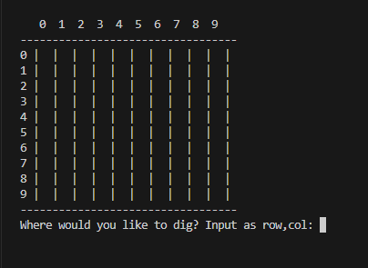

# Command-Line Minesweeper Game in Python

A simple 2D minesweeper game you can play on the console!

Doing it with the help of Kylie Ying on YT to refresh and strengthen my Python fundamentals.

You can play by running the script: `python3 minesweeper.py`

